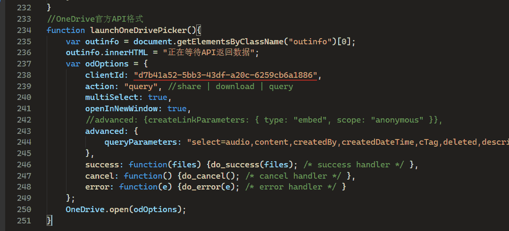
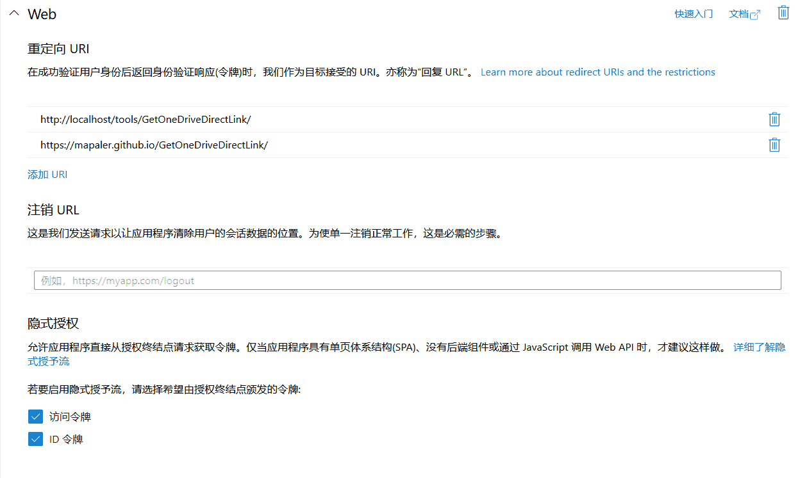
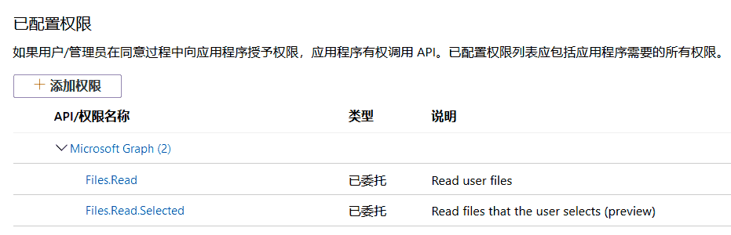

获取OneDrive直链
===========
本应用的目的是为了**批量**获取OneDrive直链，方便在其他站点外链。前身为[提取OneDrive直链地址工具](http://bbs.comicdd.com/thread-354826-1-1.html)的网页版，因为原来的工具失效了，软件版也不是那么好用了，因此决定使用OneDrive官方SDK来进行获取，确保不失效。 

# 马上使用
该翻的自己翻  
https://mapaler.github.io/GetOneDriveDirectLink/

# 隐私声明

使用微软官方[OneDrive file picker SDK](https://docs.microsoft.com/onedrive/developer/controls/file-pickers/js-v72/)，本应用不会得到你的账号密码和其他用户资料。
目前仅申请了`Files.Read`、`Files.Read.Selected`两个权限，SDK只会返回用户选择的文件的信息，不会获得未授权的其他内容。  

# 如何自行搭建
>按照[OneDrive file picker SDK](https://docs.microsoft.com/onedrive/developer/controls/file-pickers/js-v72/)内的说明进行，由于旧有的*Microsoft 应用注册门户*已经迁移到*Azure门户*，特此做出更新，此版本更新于2020年2月6日。
1. 应用注册  
在[Azure门户](https://portal.azure.com/#blade/Microsoft_AAD_RegisteredApps/ApplicationsListBlade)创建应用，自己申请一个应用 ID，然后替换本程序`script.js`内底部的`clientId`。  
  
其中`odOptions.advanced.queryParameters`内容参见 [DriveItem 资源类型](https://docs.microsoft.com/onedrive/developer/rest-api/resources/driveitem?view=odsp-graph-online)，若不设定，将只返回基本信息。
1. 设置**身份验证**  
将网页的各种东西上传到你申请 ID时设置的 重定向 URL 即可，页面 URL 不在重定向内会发生错误。注：这个页面必须为https（仅 localhost 可为 http，且 localhost 也需添加 重定向 URL）  
并且需要勾选**隐式授权**的**访问令牌**、**ID 令牌**。*讨论见[#9](//github.com/Mapaler/GetOneDriveDirectLink/issues/9)*

1. 设置**API 权限**  
添加 `Microsoft Graph` ▶ `委托的权限` ▶ `Files.Read`、`Files.Read.Selected`  
 

## 原理
`http://storage.live.com/items/ID`是很早之前就流传的SkyDrive官方的真实直链重定向地址，出处不可考。  
开始一般是用`http://storage.live.com/items/ID?filename=xxx.jpg`来外链图片，后面的文件名用来欺骗DiscuzX论坛系统，但是浏览器下载该文件还是没有正确文件名。  
后来有高手发现的`http://storage.live.com/items/ID:/xxx.jpg`这个地址格式不会影响SkyDrive识别ID，还同时可以欺骗浏览器为普通文件地址，识别出文件的文件名与扩展名。  
访问`onedrive.live.com`域名需要科学上网，但是`storage.live.com`不需要。
